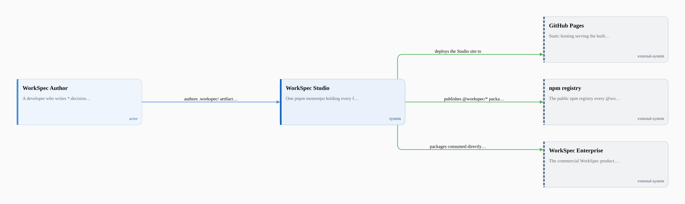
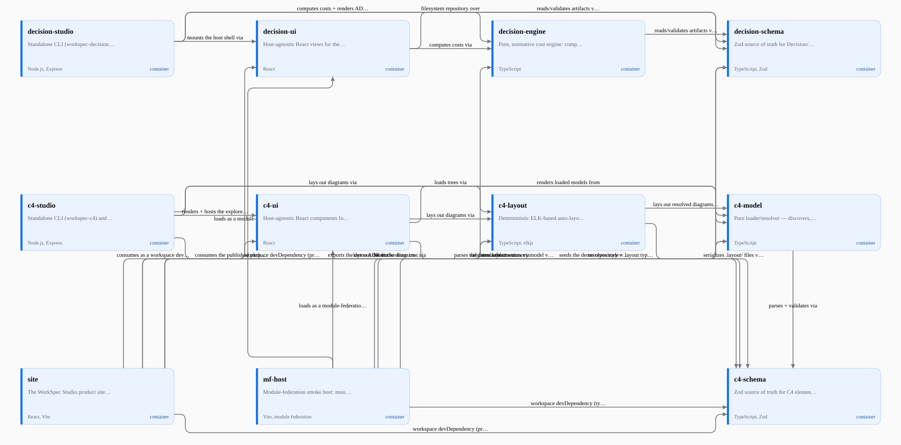

# WorkSpec Studio

The open-source **WorkSpec workbench family** — one monorepo holding every free WorkSpec
product, publishing packages that WorkSpec Enterprise consumes directly rather than
duplicating. Every package here is Enterprise-grade by constitution: Enterprise is a future
consumer of this code.

| Module      | Status      | Where                                                          |
| ----------- | ----------- | --------------------------------------------------------------- |
| Decisions   | live        | `packages/decision-*`, `apps/site`, `apps/mf-host`             |
| C4 Diagrams | in progress | `packages/c4-*`, `apps/site` (`/c4` demo), `docs/c4/`          |

## Layout

```
packages/   published @workspec/* libraries
apps/       the Studio site and smoke hosts
examples/   runnable example trees and demos
docs/       specs and design bundles
```

## Development

```bash
pnpm install
pnpm run lint        # eslint over the workspace
pnpm run typecheck   # per-package tsc (pnpm -r recursion)
pnpm run test        # per-package vitest (pnpm -r recursion)
pnpm run build       # per-package builds (--if-present)
```

CI runs the same four stages in order on every push and pull request.

## Decisions module

Costed architecture decisions as reviewable `*.decision.yaml` / `*.catalog.yaml` artifacts —
imported with full git history from
[`FieldstateNZ/workspec-decision-studio`](https://github.com/FieldstateNZ/workspec-decision-studio).

| Package                     | Path                       | Role                                                                      |
| --------------------------- | -------------------------- | ------------------------------------------------------------------------- |
| `@workspec/decision-schema` | `packages/decision-schema` | Zod source of truth → TS types, runtime validation, JSON Schema           |
| `@workspec/decision-engine` | `packages/decision-engine` | Pure, normative cost engine (no IO, no DOM)                               |
| `@workspec/decision-ui`     | `packages/decision-ui`     | Host-agnostic React views (standalone + module-federation remote)         |
| `@workspec/decision-studio` | `packages/decision-studio` | Standalone CLI + localhost host shell (`validate`, `render-adr`, `serve`) |

`apps/site` is the product site + in-browser demo (consumes the published npm packages).
`apps/mf-host` is the module-federation smoke host (CI integration proof, never published).
`examples/` holds the worked example decision/catalog trees. Docs — the schema spec, the tech
design, and the project's own dogfooded decision records (D1–D6) — live under
[`docs/decisions/`](docs/decisions).

Releases publish via [`release.yml`](.github/workflows/release.yml) on a version tag (npm
trusted publishing/OIDC with provenance) — see
[`docs/decisions/RELEASING.md`](docs/decisions/RELEASING.md).

## C4 Diagrams module

Browse, validate, and render C4 architecture trees — actors, systems, containers, components,
domains, features, and diagrams — straight from the `.workspec/` files already in your repo.
Full docs, the `.layout/` contract, and CLI usage live under [`docs/c4/`](docs/c4).

| Package                | Path                    | Role                                                                    |
| ------------------------ | ------------------------- | -------------------------------------------------------------------------- |
| `@workspec/c4-schema`  | `packages/c4-schema`  | Zod source of truth → TS types, runtime validation, generated JSON Schema |
| `@workspec/c4-model`   | `packages/c4-model`   | Pure loader/resolver: `.workspec/` tree → one typed model, with diagnostics |
| `@workspec/c4-layout`  | `packages/c4-layout`  | Deterministic ELK-based auto-layout, with `.layout/` pinning + round-tripping |
| `@workspec/c4-ui`      | `packages/c4-ui`      | Host-agnostic React components (interactive canvas + deterministic SVG export) |
| `@workspec/c4-studio`  | `packages/c4-studio`  | Standalone CLI (`workspec-c4`) + localhost host shell (`validate`, `render`, `serve`) |

The `@workspec/c4-*` library packages are published to npm at `0.1.0-alpha.0`; `@workspec/c4-studio`
is not yet published (trusted publisher pending). `apps/site`'s `/c4` page still takes the c4
packages as `workspace:*` devDependencies as a documented, temporary exception — they flip to
registry pins as a follow-up — see [`docs/c4/drift-log.md`](docs/c4/drift-log.md).

## Architecture

This repo documents its own architecture as a `.workspec/` tree at the repo root, validated and
rendered by its own `@workspec/c4-studio` CLI — the same tool this monorepo publishes.

**System Context** — who and what WorkSpec Studio talks to:



**Container** — every published package plus the two consuming apps, and the real workspace
dependency edges between them:



Both SVGs are **generated, committed artifacts** — regenerate them with `pnpm run render:c4`
(root script) any time `.workspec/` changes. Rendering is deterministic, which is what makes a
package test (`packages/c4-studio/src/dogfood.test.ts`, run by the ordinary `pnpm run test`) an
honest staleness gate: it re-renders both diagrams from the live tree and asserts byte-identical
output against these committed files, alongside asserting the tree itself validates with zero
diagnostics.

## License

[Apache-2.0](LICENSE)
